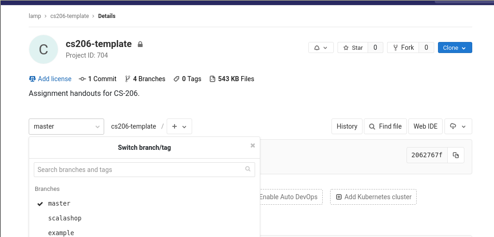

# CS-206 Assignments

This repository contains your assignments for *Parallelism and Concurrency* course.
Course material and administrative details can be found in the
[cs206-2020 project](https://gitlab.epfl.ch/lamp/cs206-2020).

## To select a branch on [gitlab.epfl.ch](https://gitlab.epfl.ch), click on "master" (under project description)

